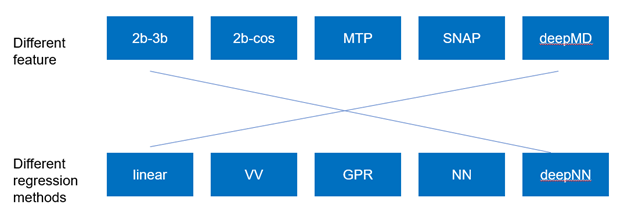

Machine Learning Force Field
========================================

An overview
--------

Machine Learning Force Field (MLFF) is an open source software under GNU license. It aims at generating force fields with accuracy comparable to Ab Initio Molecular Dynamics (AIMD). It is compatible with AIMD data with either **PWmat** or **VASP** format. You can access the code from https://github.com/LonxunQuantum/MLFF, or http://www.pwmat.com/pwmat-resource/module-download/file/MLFF.zip. 

You can also access our online AIMD data archive via https://www.jianguoyun.com/p/DUWoiP4Ql-_OChiEk8IEIAA

This package contains 8 types of features with translation, rotation, and permutation invariance, which are

        1. 2-body(2b)
        2. 3-body(3b) 
        3. 2-body Gaussian(2bgauss)
        4. 3-body Cosine(3bcos) 
        5. Multiple Tensor Potential(MTP)
        6. Spectral Neighbor Analysis Potential(SNAP)
        7. Deep Potential-Chebyshev(dp1)        
        8. Deep Potential-Gaussian(dp2) 

and 4 engines for training and prediction, which are 

        1. Linear Model
        2. Nonlinear VV Model
        3. Kalman Filter-based Neural Netowrk (KFNN)
        4. Kalman Filter-based Deep Potential Model(KFDP)

In practice, user may freely combine features with models (except for Deep Potential model, since it defines feature differerntly). A illustration of such a process is shown below. In the future, we will also add support for user-defined features and training models. 

An complete MLFF workflow contains 3 major steps. **Firstly**, use eitehr PWmat or VASP to run AIMD calculation to generate training data (features and direvatives of features, .etc), and perform post-processing of the data. **Secondly**, run training engine to obtain the force field; **Finally**, use the obtained force field to make inference. There are two kinds of inference: **test** and **prediction**. 

In **test**, one first prepare a MOVEMENT file generated by Ab Initio calculation, use the obtained force field to calculate energy and force, and compare them against the Ab Initio results. This step can be seen as a more rigorous assessment of the quality of the force field. Error given by this test is usually larger than the error given the training. 

In comparison, **prediction** solves real challenges. Like a Ab Initio MD calculation, it starts with a initial image, and simulates the ensuing process based on the force field and the conditions specified.  Ideally, during prediction, the code should tell you whether the mlff is in a “safe” space (within the region which has been tested), and whether some kind of retraining (e.g. active learning) is necessary. We will release such capability in the future version. Right now, this is done by the test step, or by human intelligence (e.g., if you see some configuration during mlff MD is obviously not included in your training data set). This part uses PWmat MD module as defualt, but for Model 1,2,and 3, you can also use **LAMMPS**. 

The detail of these steps will be elaborated in the following sections. 

Installation
-------------

**On Mcloud**

Mcloud is equipped with a ready-to-use MLFF environment. Use the following commands to load MLFF environment

::

    source /share/app/anaconda3/etc/profile.d/conda.sh
    module load intel/2020
    module load cuda/11.3
    module load MLFF/2022.05.23
    conda activate mlff

**On your own workstation** 

We recommmend using **Anaconda** for package installing and management. You should first install Anaconda following the steps shown on its official website. Please don't attempt to use miniconda instead of Anaconda, since it might incur various dependecy and path errors that are hard to debug. 

To install conda environment, use the following command. You may choose a new version of Anaconda. 

::

    wget https://repo.anaconda.com/archive/Anaconda3-2020.07-Linux-x86_64.sh

Then, create a new environment for this module. We recommend using Python 3.8.  

::
    
    conda create -n mlff python=3.8

After mlff has been created, re-enter the current environment.
        
:: 
    
    conda deactivate
    conda activate mlff

After this, install the following packages. 

::

    conda install pandas
    conda install matplotlib
    conda install scikit-learn-intelex
    conda install numba         
    conda install tensorboard

Next, you should identify the architecture of your Nvidia GPU and install a compatible pytorch version. We take RTX 3080Ti as an example. It is fabricated in Ampere architecture, and requires CUDA 11.1 or later. **Also**, the one-click installation via conda only supports 4 CUDA version, which are CUDA 10.2, CUDA 11.1 CUDA 11.3 and CUDA 11.5. Thus, CUDA 11.1, CUDA 11.3 and CUDA 11.5 are reasonable choice for RTX 3080Ti. We choose to use CUDA 11.3 as an example. Therefore, you can install pytorch with the following command

::

    conda install pytorch torchvision torchaudio cudatoolkit=11.3 -c pytorch 

The way to load a speific CUDA version differs across platforms. If you are working on a cluster, it is common to use **module load** command to load specific CUDA library. If you are working on your own workstation, unless a specific CUDA version is pre-installed, you should install it on your own. Refer to Nvidia official website for more details. 

You can check the following article to determine which CUDA to use on your GPU device.  

::

    https://arnon.dk/matching-sm-architectures-arch-and-gencode-for-various-nvidia-cards/

Having configured CUDA correctly, enter src/op and run the following commands to compile acceleration modules. Notice that the compilation must take place on host that has available GPU. If you are working on a cluster, you can use the the following to start a interactive job for compilation. 

::

    srun -p mygpupartition --gres=gpu:1 --pty bash

**You should make sure that your g++ compiler supports C++ 14 standard!** Also, you should modify the path in setup.py. It should be the bin directory in your CUDA path. To obtain the CUDA path, use 

::

    echo $CUDADIR

and the path in setup.py file should therefore be:

::

    what/echo/CUDADIR/tells/you/bin

To compile, use the following command.

::

    python3 setup.py install  

MLFF switches to use the above modules when GPU is available. However, this is a good option only for KFDP engine. For KFNN, training on GPU appears less efficient than on CPU. Certainly, we will bring modifications in future releases to better utlize the power of GPU in KFNN. We will eleborate on how to choose the computing device in following sections. 

Now, enter the src directory and compile source codes. Intel 2020 module must be loaded. 

:: 

    module load intel/2020
    cd src
    sh build.sh
    

After compilation, you should modify environment variables. The absolute path of src/bin should be exported in ~/.bashrc. You can use "echo $PWD" to obtain the absolute path.

::

    vim ~/.bashrc 
    export PATH=absolute/path/of/src/bin:$PATH
    source ~/.bashrc 

Generate AIMD training data 
--------------------------

**PWmat**

You should first run AIMD on the system of interst to obtain training data, which is simply the MOVEMENT file generated by the MD calculation. As a common practice, we run several MD simulations under different conditions(such as temperature), each of which goes for a several thousands MD steps. The idea behind is to have enough atomic configurations to cover all the situations you might encounter in later force field-based preidictions.  

PWmat's unique energy decomposition functionality can be ultilized during generating training data. To use it, set **energy_decomp = T** in etot.input. You might also need to adjust **energy_decomp_special** in accordance with you situation. Please be sure to refer to PWmat's manual for details involving MD calculations. 

An etot.input example for MD calcualtion is given below. 

:: 

    16  1
    JOB = MD
    IN.PSP1 = Cu.SG15.PBE.UPF
    IN.ATOM = atom.config
    MD_DETAIL = 3 2000 0.8 300 300
    E_Cut = 60 
    precision = double
    energy_decomp = T       #this flag must be true
    mp_n123 = 1 1 1 0 0 0 2
    xcfunctional = GGA
    E_error = 1.0e-6
    Rho_error = 1.0e-4

**VASP**

You can use the ultily module **xdat2move.py** to convert VASP's XDATCAR output to MOVEMET format. 

::
    
    xdat2move.py myXDARCAR

..
    **Principles for generating trianing data**

    As the first principle, training data set should well represent the 3N-dimensional phase space, where N is the number of atoms. That is, data should include the system’s spatial configurations as many as possible. The reason is self-evident under the framework of energy decomposition. In our example, the training data is usually made up of images from more several MD results with varying condtitions. However, these images are sampled from the raw data, otherwise data size can be overwhelming. We now use some naïve rules to pick up images from the raw data. We may introduce more complex sampling method in the future. 

Generate training data
-----------------------

You should first create a working directory for your system.  For instance, our example data is a Cu bulk system, and you can create a directory called "Cu_bulk" for it 

::  
    
    mkdir Cu_bulk 

Enter this directory, and create a director called "PWdata" for MOVEMENT files. 

.. image:: pictures/PWdata.png 

In Cu_bulk, create a directory callled **PWdata**. In PWdata, **create a single directory for each MOVEMENT file you wish to train**, and move all the MOVEMENT files in their corresponding directory. Notice that it is ok for different MOVEMENT to have different atom number. Name of the directory does not matter here. For example, 

.. image:: pictures/data123.png 

It is very important to put multiple MOVEMENT files in seperate directories: that being said, do not concatenate multiple MOVEMENT files into one. This is because in **seper.py** which will be used in KFNN and KFDP, a simple 80%-20% cut is used to form the training set and the validation set. Without doing so, you will probably end up with having a case that is not trained at all and only used as validation data! 

Go back to Cu_bulk, and create a python script called **parameters.py**. Like etot.input in PWmat, it is the master script that contains the relevant parameters. **In MLFF workflow, this is the only file user needs to modify**. 

You should first add **codedir** in parameters.py. It should be the absolute path of the MLFF package, which is the one that contains directory src. Notice that letter r must appear in front of the path string. **On Mcloud, such a path is simply** 

::
    
    codedir=r'/share/app/MLFF' 

Now, the feature generation may starts. Set the following parameters in **parameters.py**: 

**atomType**: the atomic numbers. In the example case, system consists of only Cu, thus atomType should be [29]. If the system contains more than one element, all atomic numbers should be specified. For instance, atomType should be [8,29] for CuO. Order does not matter here. 

**use_Ftype**: features fed into the training process. Usually, combinations such as [1,2],[3,4],[5],[6],[7],[8] are used, but you are free to explore other combinations. In the given example, we use [1,2]. Note that feature 6 could be slow. 

**isCalcFeat**: set to be True. Notice that this step will generate feature output files that can be reused by other training processes. They are stored in directory fread_dfeat. 

Besides, you should also pay attention to 2 extra parameters that are relevant: 

**Rc_M**: the cutoff radius of feature generation, in Angstrom. Since all of our 8 features are "local", which assumes that atomic properties such as energy are determined by near neighbors, this parameter controls how many neighbors are taken into account when generating features. Its default value is 6, but we recommand you trying different values for different system. 

**maxNeighborNum**: size of buffer, with default value 100. However, for some systems it is not enough to accommodate all the neighbors, and thus the feature generation fails. The singal of such an error can be found in /output. For each feature, an out file is generated. There should be out1 and out2 if feature combination [1,2] is chosen. In each out file, feature generation detail of each MD step is recorded. The correct scenario is shown below. 

.. image:: pictures/feature_success.png

If, however, you find that no information was printed, like the scenario shown below, you shoud assign **maxNeighborNum** with a larger number. 

.. image:: pictures/feature_fail.png 

For our example, a correct parameters.py should look like this 

.. image:: pictures/parameters.png  

After parameters.py are all set, run mlff.py in the current directory to obtain the features. 

::
    
    mlff.py

Having generated the feature data, you can now feed them into various training models. **isCalcFeat** should be turned off now. 

Model 1: Linear Model
----------------------

1.Training
^^^^^^^^^^

Turn on **isFitLinModel** to lanuch linear fitting. After training, you should turn off **isFitLinModel**. You should prepare a **parameters.py** that looks like this:

.. image:: pictures/lin_fit.png 

In the training of linear model, atomic energy, total energy and force are all used as training data. Their default weights are 0.2, 0.6 and 0.2. You can define the following parameters in **parameters.py** to adjust the weights, or turn off some of them. For example, the following setting means that only total energy is used for training. 

::

    fortranFitWeightOfEnergy = 0.0 
    fortranFitWeightOfEtot = 1.0
    fortranFitWeightOfForce = 0.0 

2.Inference
^^^^^^^^^

Test
""""

Prepare another Ab Initio MOVEMENT file. In **Cu_bulk**, Create a new directory called **MD** and move the MOVEMENT file you wish to test against into it.  

Several parameters should be set in **parameters.py**. 

**isNewMd100**: set True

**imodel**: set to be 1, which is linear model. 

**md_num_process**: the mpi process number you wish to use. Its value can be up to the number of available cores in you CPU. 

Finally, use mlff.py to start a test. 

**Please be considerate when using Mcloud or other clusters: do not run mlff.py on the login node!** Instead, submit job via following slurm script: Notice that when submitting jobs through slurm, **ntasks-per-node** determines how many cores you can use. 

::

    #!/bin/sh
    #SBATCH --partition=mypartition
    #SBATCH --job-name=myjobname
    #SBATCH --nodes=1
    #SBATCH --ntasks-per-node=1
    #SBATCH --threads-per-core=1

    conda activate mlff

    mlff.py

Copy the above to a file, and name it **run.sh**. Notice that if you are working on Mcloud, replace **conda activate mlff** with the following block:

::

    source /share/app/anaconda3/etc/profile.d/conda.sh
    module load intel/2020
    module load cuda/11.3
    module load MLFF/2022.05.23
    conda activate mlff

Use the following command to submit:

::

    sbatch run.sh

In our example, a new MOVEMENT file can be found after the test. You can use **plot_mlff_inference.py** to visualize the results. The generated plot will appear in the working directory. 

::

    plot_mlff_inference.py 

Below is a plot of results for the Cu sample data. 

.. image:: pictures/lft.png

Prediction
""""""""""

The process of prediction is almost identical to that of MD in PWmat. First, create a **atom.config** file that contains an initial image. Next modify **md.input** generated in **test** step. Such a file should appear like this: 
::

    md.atom.config             (input file name )
    1, 100, 1.0, 600, 600      (MD_DETAIL as in PWmat MD calculatoin)
    F                          (Place holder)
    1                          (Type of model used for prediction. 1 stands for linear model)
    1                          (interval of MOVEMENT image taken. No need to change unless necessary)
    1                          (type of atom)
    29 58                      (atomic number and mass)

You should modify the first and the second line according to your need. The first line specifies the input file of the initial image. The second line is the same as **MD_DETAIL** flag in PWmat MD calculation. Please refer to PWmat's user manual for details. 

Use the following command to run prediction after parameters are set. **NUM_THREAD** stands for the mpi process number you wish to use. You can use the following 

::

    mpirun -n NUM_THREAD main_MD.x 

If you are working on Mcloud or other clusters, use the following script. Modify parameters according to the rules in "Test" section. 

::  

    #!/bin/sh
    #SBATCH --partition=mypartition
    #SBATCH --job-name=myjobname
    #SBATCH --nodes=1
    #SBATCH --ntasks-per-node=1
    #SBATCH --threads-per-core=1

    mpirun -n NUM_THREAD main_MD.x 

The outputs of prediction are the same as those of PWmat MD calculation. 

**LAMMPS**

To use LAMMPS as the MD engine, you should add these lines in LAMMPS's input file:

::

    
    pair_style qcad
    pair_coeff  * * 1 5 29

The first line specify pair style. In the second line, the first to stars are place holder. "1" represents the model you are using (in this case it is linear model). 5 means calculating neighbors every 5 steps. 29 is the first type of atom in the system. Notice that for system with more than 1 type of element, the atom numbers of all element should listed. For example, if the system is CuO, the second line should be: 

::

    pair_coeff  * * 1 5 8 29

Model 2: Nonlinear Model(VV) 
-------------------------

VV(vector-vector) goes beyond linear fitting by introducing nonlinearity. In linear model, we approximate the total energy by a linear combination of features. But in VV, we build a new set of features from the old ones. These new features are generated by feeding old ones into nonlinear functions. For example, they could be exp(-F_i), F_i* F_i, F_i* F_i *F_i, .etc.

1.Training
^^^^^^^^^^

First, perform feature generation and fitting as in linear model. Next, we start the training of VV model. It consists 2 parts: first, it generates secondary features based on the primary features; second, it selects a set of secondary features that brings the greatest reduction in the loss function. We call them **generation** and **selection** respectively. 

**Generation**

Run select_mm_VV.r in the working directory.   

::

    select_mm_VV.r

You should input the following parameters.

**itype**: type of atom taken into account. If system only consists of 1 type of atom, input 1; if there are more than 1 type of atom, input should be 1, or 2, or 3, .etc. We will elaborate on how to deal with more than one type of atom below. 

**iseed**: a minus integer seed. It is used to randomly form a temporary training set and test set. 

**include feat^3**: enter 0. This means do not inlcude cubic terms in the secondary feature. 

**iscan_MM, or not**: enter 1

You can observe that this routine is looping over the secondary features. Finally, 8000 secondary features are obtained. Each loop takes increasingly long time since it involves diagonalization of a dense matrix of increasing dimension. 

**Selection**

Run select_VV_MM.r again to select the best secondary features. Input parameters as follows:

**itype**: same as previous run

**iseed**: same as previous run

**include feat^3**: enter 0

**iscan_MM, or not**: enter 0

**input mm**: the number of secondary feature you wish to choose. 1000 to 2000 is a resonable range. 

**More than 1 type of element?**

For system with more than one type of element, you should run **generation** and **selection** more than once. For each type of element, you should run **generation** and **selection**  with resepct to each element. That is, run the whole selection with **itype=1**, and next **itype=2**, **itype=3**, etc. **iseed** and **input mm** must match in each selection. 

After **generation** and **selection**, prepare a file called **select_VV.input**, which should have the following format 

::  
    
    10
    2000           (mm number you used)
    20
    0
    20,4,2.0,0.001

You can keep everything except the mm number as a template.   

Copy **select_VV.input** into **fread_dfeat** directory, and run feat_dist_xp.r. Choose 1 when input selection pops up. 

::

    feat_dist_xp.r

Finally, go back to your working directory, and use **fit_VV_forceMM.r** to fit. You can observe that the number of feature used to fit, as well as the time to fit, significantly increased. 

::

    fit_VV_forceMM.r

2. Inference 
^^^^^^^^^^^^^

Test
""""

This step is similar to that of linear model. Add the following parameters in **parameters.py**. **isCalcFeat**  and  **isFitLinModel** shoudl be turned off. 

**isNewMd100**: set to be true 

**imodel**: 2, i.e. MD mode for VV

**md_num_process**: number of process you wish to use. 

Next, run 

::

    mlff.py

or submit job via script

::

    #!/bin/sh
    #SBATCH --partition=mycpupartition
    #SBATCH --job-name=myjobname
    #SBATCH --nodes=1
    #SBATCH --ntasks-per-node=32
    #SBATCH --threads-per-core=1

    conda activate mlff_debug

    mlff.py

Notice that if you are working on **Mcloud**, replace **conda activate mlff** with the following block:

::

    source /share/app/anaconda3/etc/profile.d/conda.sh
    module load intel/2020
    module load cuda/11.3
    module load MLFF/2022.05.23
    conda activate mlff

After MD, you can visualize the results as introduced in the linear model section. 

The graph below shows a VV inference on Cu1646 case. However, there is no guarantee that the choice of parameters is optimal. We will further explore better combinations of parameters. 

.. image:: pictures/vv.png 

Prediction
""""""""""""

The procedure is identical to that of linear model. 

**LAMMPS**

The procedure is the same as that of linear model. 

Model 3: Kalman Filter-based Neural Network
--------------------------------------------

In this Model, we use Kalman filter to improve the bare neural network(NN). Essentially, Kalman filter smooths the “spikes” of the high dimension cost function, curbing the likelihood of falling into local minimum. 

1.Training
^^^^^^^^^^

First, several NN parameters should be set. 

**natoms** If more than one type of atom present, one should also set natoms correctly. For example, if the system of interest consists of 4 Cu atom and 7 Au atom, then you should set atomType = [29,79] and natoms = [4,7]. 

**nFeatures** It is the number of features. It should be the sum of the two numbers in the last line of   /fread_dfeat/feat.info. In our example, nFeatures is 42. 
        
**use_GKalman**: set to be True

**is_scale**: set to be True

**storage_scaler**: set to be True. **This is important since it saves the scaler of data for later MD runs.** 

**itype_Ei_mean**: the estimation of mean energy of each type of atom. You should go to train_data/final_train and take a look at engy_scaled.npy via the following commands,

::

    cd train_data/final_train
    python 
    import numpy 
    numpy.load("engy_scaled.npy")

You don't need an excact mean, and a rough estimate should suffice. For example, for a CuO system which contains 2 types of atom, if the commands above returns something like this:

::

    array([[174.0633357],
       [174.0604308],
       [174.0453315],
       ...,
       [437.0013048],
       [437.3404306],
       [437.2137406]])

you can just set 

::

    itype_Ei_mean=[174.0,437.0] 

**n_epoch**: the number of epoch for training. You can start with 100. 

At first, you might want to modify the setting of NN network. However, if you are not totally familiar with the NN theory, it is ok to use the default value.  

**nLayer** The layer of neural network. Notice that more layers does not mean better result! The default value is 3.  

**nNode**: Number of nodes in each layer. The default setting is 15, 15, 1. The format of network setting looks like this:

::

    nNodes = np.array([[15],[15],[1]]) 

This means the first and the second layer have 15 nodes each, and the final layer is the output layer with only 1 node. 

If the system has more than one type of element, each type should be assigned with a network. For exmaple, for a system with 2 types of element, set up the networks in the following manner: 

::

    nNodes = np.array([[15,15],[15,15],[1,1]]) 

You can adjust the network size according to your need. Be advised, however, that due to the heavy computation required by KF, node number per atom should not be too large, and 15 appears reasonable in our test. 

**Please note that right now, only total energy is used as training data in KFNN. We will include atomic energy and forces in the future releases.**

We now use **seper.py** to devide data into a training set and a validation set. Currently, the default division is a simple cut between first 80% and 20%. Run the following command in the same directory. 

::

    seper.py

Next, use gen_data.py to re-formulate data. After this step you will find them in the directory **train_data**. 

::

    gen_data.py

You can now launch **train.py**. You should also specify a directory with flag -s to save the logs and models. As stated above, training in GPU is not efficient as in CPU at this point. To force using cpu, add **--cpu** flag.

::
    
    train.py -s records --cpu

On Mcloud or your own cluster, use a script to submit a job. For example, 

::
        
    #!/bin/sh
    #SBATCH --partition=mypartition
    #SBATCH --job-name=myjobname
    #SBATCH --nodes=1
    #SBATCH --ntasks-per-node=num_of_threads
    #SBATCH --threads-per-core=1
    
    conda activate mlff 

    train.py -s records 

Notice that if you are working on **Mcloud**, replace **conda activate mlff** with the following block:

::

    source /share/app/anaconda3/etc/profile.d/conda.sh
    module load intel/2020
    module load cuda/11.3
    module load MLFF/2022.05.23
    conda activate mlff

2. During training
^^^^^^^^^^^^^^^^^^

During training, you can monitor te progress by checking the logs in **records** directory. 

**epoch_loss.dat**: loss, RMSE_Etot, RMSE_Ei, RMSE_F of training set in each epoch. 

**epoch_loss_valid.dat**: RMSE_Etot, RMSE_Ei, RMSE_F of valid set in each epoch.  

**model**: directory that contains the obtained models. The latest and the best model will be saved. 

You can use -R to plug in previously trained models. It will automatically search for "latest.pt" in record/model 

::

    train.py -R  

You can compare epoch_loss.dat and epoch_loss_valid.dat to see if an overfitting occurs. 

3. Inference 
^^^^^^^^^^^^

Test
""""

Copy **read_torch_wij.py** from diretory utils to the directory you are working in. Also, copy the compiled executable **main_MD.x** in QCAD/fortran_code into **src/bin**. 

Run 

::

    read_torch_wij.py

in your working directory. You should find **Wij.txt** and **data_scaler.txt** in /fread_dfeat after this step.  

Next, set the following parameters in parameters.py 

**isNewMd100**: set to be true 

**imodel**: 3, i.e. MD mode for NN

**md_num_process**: number of process you wish to use. 

Next, run 

::

    mlff.py

or submit job via a script

::

    #!/bin/sh
    #SBATCH --partition=mycpupartition
    #SBATCH --job-name=myjobname
    #SBATCH --nodes=1
    #SBATCH --ntasks-per-node=32
    #SBATCH --threads-per-core=1

    conda activate mlff_debug

    mlff.py

Notice that if you are working on **Mcloud**, replace **conda activate mlff** with the following block:

::

    source /share/app/anaconda3/etc/profile.d/conda.sh
    module load intel/2020
    module load cuda/11.3
    module load MLFF/2022.05.23
    conda activate mlff

This step is similar to the MD calculation in PWmat. After this, you can find a MOVEMENT file in the currently directory, which is generated by the MLFF-MD calculation. Use 

::

    plot_mlff_test.py 

to generate plot of the test result. The following plot shows the KFNN inference result on cu1646 case. 

.. image:: pictures/nn.png  

Prediction
""""""""""

The procedure for KFNN prediction is the same as in the linear model. You should alter the type of model for inference (which should be 3 in this case) accordingly.    

**LAMMPS**

The procedure is the same as that of linear model.
 
Model 4: Kalman Filter-based Deep Potential 
---------------------------

In this model, we incorporate Kalman filter with Deep Potential model. You may choose to run DP with or without Kalman filter. 

1.Training
^^^^^^^^^^

Deep Potential model does not require input feature, but you still need a placeholder. Use feature 1 for this purpose. Next, set the following parameters. 

**dR_neigh**: set to be True

**use_LKalman**: set to be true if you wish to apply local Kalman filter upon DP. Note that **do not** attempt to use global KF, since memory usage will be unreasonably large. You should set the network configuration accordingly. See below. 

**batch_size**: without KF, batch size can be larger than 1. You can start with 4. But if KF is applied, batch size can only be 1

**n_epoch**: You need a epoch number larger than in KFNN. DP might take several thousands epochs to converge. However, since a single DP epoch is faster, there is no substantial difference between the total training time of DP and that of KFNN. If KF is used, epoch number can be smaller. 

**nFeatures**: check the feature number in output/outx, with x being the feature index you chose. 

Having done the above, run **seper.py** and **gen_data.py** as in model 3. 

To initiate training, you should also choose a network configuration class in accordance with the model. 

**DP_cfg_dp**: without KF

**DP_cfg_dp_kf**: with KF 

In trainning, pass it in as an argument after flag **-n**.

::
    
    train.py --dp=True -n DP_cfg_dp -s record

You can also use the following script to submit job on your cluster. You have to submit this to nodes with at least 1 available GPU. 

::

    #!/bin/sh
    #SBATCH --partition=mygpupartition
    #SBATCH --job-name=cu1646_dp1
    #SBATCH --gres=gpu:1 
    #SBATCH --nodes=1
    #SBATCH --ntasks-per-node=4
    #SBATCH --threads-per-core=1
    
    conda activate mlff

    train.py --dp=True -n DP_cfg_dp -s record 

Notice that if you are working on **Mcloud**, replace **conda activate mlff** with the following block:

::

    source /share/app/anaconda3/etc/profile.d/conda.sh
    module load intel/2020
    module load cuda/11.3
    module load MLFF/2022.05.23
    conda activate mlff

2. Inference 
^^^^^^^^^^^^

Test 
""""

Move all the files in **PWdata** to a backup directory, and make **PWdata** empty. Copy MOVEMENT file you wish to test against into **PWdata**. Before starting, modify the following parameters in **parameters.py**: 

**test_ratio**: set to 1. This means that all images are used for testing. 

Also remove the previous directory that contains training data 

::
    
    rm train_data/ fread_dfeat/ output/ input/ -r 

Now, perform data processing as in training: 

::

    mlff.py
    seper.py
    gen_data.py

Finally, run 

::
    
    test.py --dp=True -n DP_cfg_dp 

RMSE of total energy and force will be reported at the end. A plot will also be generated. 

Prediction
""""""""""

First, backing up all the files in /PWdata. Create 2 files for MD calculation:

**atom.config**: The initial image for MD calculation. Other names are not allowed. 

**md.input**: The input file for MD calculation. For Deep Potential model prediction, this file should look like this:

::

    atom.config             (input file name)
    1, 100, 1.0, 600, 600   (MD_DETAILS in PWmat MD calculation)
    F                       (Place holder)
    4                       (Type of model, 4 stands for dp)
    1                       (interval for MD movement. No need to change)
    1                       (Types of atom)
    29 58                   (Atomic number and mass)

Also, add the following parameters in **parameters.py**

**dp_predict**: set to be True 

**test_ratio**: set to 1. 

Finally, use main_MD.x to start calculation. Notice that for this model, do not use mpirun 

::

    main_MD.x

The current version of DP prediction is a bit slow. We will release accelerated version in the future. 
